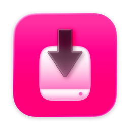
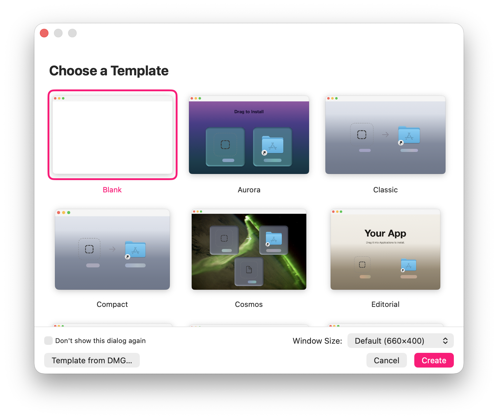

<div align="center">

[](https://kagerou.glass/rilmazafone/)



# rilmazafone

**rx no. 004 ・ ril·maz·a·fone /rɪlˈmæzəfoʊn/ ・ a prodrug for the disk image ♡**

[](https://kagerou.glass/rilmazafone/)
[](https://x.com/kageroumado)
[](#requirements)

<a href="https://apps.apple.com/app/apple-store/id6790960011?pt=128650112&ct=GitHub&mt=8"></a>

<table>
  <tr>
    <td align="center"><br><sub><b>the canvas</b> ・ drag icons where they'll sit in Finder; the inspector drives background, window, and icon layout</sub></td>
  </tr>
  <tr>
    <td align="center"><br><sub><b>templates</b> ・ start from Aurora, Classic, Cosmos, Editorial… or a blank canvas</sub></td>
  </tr>
</table>

</div>

> **服用注意 ・ the installer, drawn.**
>
> A DMG is the first thing anyone sees of your app, and building a nice one has always meant
> shell scripts, `hdiutil` incantations, and a `.DS_Store` you pray copied correctly. A prodrug
> is an inert design that becomes the real thing only once it's taken up — and that's the shape
> of a `.dmgtemplate` here: you *draw* the installer on a WYSIWYG canvas, position every icon
> exactly where it lands in Finder, style the background, and press **Build**. What you drew is
> what mounts. No scripts, no guessing. ♡

---

A native macOS app for creating beautifully styled DMG disk images. Design your installer visually with a WYSIWYG canvas, then build a production-ready DMG with one click.

## Features

- **WYSIWYG Canvas** — Drag and position icons exactly as they'll appear in Finder
- **Background Layers** — Images, gradients, or solid colors with blur, color adjustments, vignette, and bloom effects
- **Variable Blur** — Linear or radial blur masks with live preview
- **Text & Symbol Layers** — Add styled text and SF Symbols composited into the background
- **Item Backgrounds** — Per-icon frosted glass panels with shadow, bevel, and blend modes
- **Volume Icon Composition** — Automatically generates a disk icon from your app's icon
- **Alignment Guides** — Smart snapping to center, thirds, and sibling elements
- **Code Signing** — Optional signing with automatic keychain identity detection
- **Multiple Formats** — UDZO, UDBZ, LZFSE, LZMA compression; HFS+ or APFS filesystem
- **Comprehensive Undo/Redo** — Every action is undoable

## Download

Two dispensations, one app:

- **[Mac App Store](https://apps.apple.com/app/apple-store/id6790960011?pt=128650112&ct=GitHub&mt=8)** — $19.99, one time. The same designer and build pipeline, sandboxed, installed and updated the App Store way. The price is not a feature gate — it's the support channel: buying it funds the time that keeps the free edition free, and it's the most direct way to say *keep going*. ♡
- **[GitHub Releases](https://github.com/kageroumado/rilmazafone/releases/latest)** — free, MIT, notarized DMG. The full experience, CLI included.
- **Homebrew** — `brew install --cask kageroumado/tap/rilmazafone` — the same free DMG, via [my tap](https://github.com/kageroumado/homebrew-tap). The fully qualified name auto-trusts the cask under Homebrew 6's tap-trust system.

Whichever you pick, you get the real thing — see [Build Variants](#build-variants) for the exact differences.

## Requirements

- macOS 26.0+
- Xcode 26.0+

## Building

```bash
git clone https://github.com/kageroumado/Rilmazafone.git
cd Rilmazafone
open Rilmazafone.xcodeproj
```

Build and run from Xcode (Cmd+R). No external dependencies — the project uses only Apple system frameworks.

### Running Tests

Open the Test navigator in Xcode (Cmd+6) and run all tests, or from the command line:

```bash
xcodebuild test -project Rilmazafone.xcodeproj -scheme Rilmazafone -destination 'platform=macOS'
```

The test suite covers DS_Store binary format correctness, Alias record generation, Codable round-trips, and document read/write with undo.

## Usage

Rilmazafone is a document-based app — each `.dmgtemplate` file represents one DMG design.

### Basic Workflow

1. **Create a new document** (Cmd+N)
2. **Add your app** — Drag a `.app` bundle from Finder onto the canvas, or click the **+** button at the bottom of the sidebar and choose "Add Application...". An Applications symlink and an arrow symbol are added automatically.
3. **Add additional items** — Use the **+** button or drag files/folders onto the canvas to include READMEs, license files, or additional resources. Items can be set to copy or symlink via the inspector.
4. **Design the background** — Switch the background type in the inspector between None, Color, Gradient, or Image. For image backgrounds, drag images onto the canvas or sidebar. Multiple image layers can be stacked and individually adjusted with blur, variable blur, color adjustments, vignette, and bloom effects. Text and SF Symbol layers can also be added — all layers are composited into a single background PNG at build time.
5. **Configure appearance** — Use the inspector to adjust icon size, text size, grid spacing, and window dimensions. Size presets (Compact, Standard, Large) apply coordinated defaults. Per-icon frosted glass backgrounds with shadow and bevel effects can be enabled in the Effects section when an item is selected.
6. **Configure build settings** — In the inspector, choose your compression format and filesystem:

   | Format | Description |
   |--------|-------------|
   | **LZFSE (ULFO)** | Fast, good compression. Default. macOS 10.11+ |
   | **zlib (UDZO)** | Most compatible. Works on all macOS versions |
   | **bzip2 (UDBZ)** | Smaller than zlib, slower to create |
   | **lzma (ULMO)** | Smallest files, slowest compression |

   | Filesystem | Description |
   |------------|-------------|
   | **APFS** | Modern filesystem. Default. macOS 10.13+ |
   | **HFS+** | Legacy. Use for compatibility with older macOS |

   Enable **Code Signing** if you need the DMG signed — Rilmazafone auto-detects signing identities from your keychain. If your app is already signed, the matching identity is pre-selected automatically.

7. **Build** — Click the Build button in the toolbar (or Cmd+Shift+B), choose an output location, and the DMG is created. The build sheet shows progress through each step.

### Command Line

Rilmazafone can also build DMGs headlessly from the terminal, useful for CI/CD pipelines and automation. The CLI is exclusive to the GitHub build — the App Store build launches the GUI regardless of arguments.

```bash
# Generate a starter template
Rilmazafone.app/Contents/MacOS/Rilmazafone init MyApp.dmgtemplate

# Edit document.json to set volume name, items, source paths, etc.
# Then build:
Rilmazafone.app/Contents/MacOS/Rilmazafone build MyApp.dmgtemplate -o dist/MyApp.dmg
```

For convenience, symlink the binary:

```bash
ln -s /Applications/Rilmazafone.app/Contents/MacOS/Rilmazafone /usr/local/bin/rilmazafone
rilmazafone init MyApp.dmgtemplate
rilmazafone build MyApp.dmgtemplate -o MyApp.dmg
```

Run `rilmazafone --help`, `rilmazafone build --help`, or `rilmazafone init --help` for full usage.

**Key `document.json` fields for CLI use:**

| Field | Description |
|-------|-------------|
| `volumeName` | Name shown when the DMG is mounted |
| `items` | Array of icons to place. Set `kind` (`app`, `file`, `folder`, `applicationsSymlink`), `label`, `sourcePath` (absolute or `~/`-prefixed), and `position` (`[x, y]`) |
| `window.width` / `window.height` | Finder window dimensions |
| `iconSize` | Icon size in the Finder window |
| `dmgFormat` | Compression: `ULFO` (LZFSE), `UDZO` (zlib), `UDBZ` (bzip2), `ULMO` (lzma) |
| `filesystem` | `APFS` or `HFS+` |
| `codeSign.enabled` / `codeSign.identity` | Optional code signing |
| `background.type` | `none`, `color`, `gradient`, or `image` |

Progress prints to stderr. Exit code 0 on success, 1 on failure.

## Architecture

Rilmazafone is a SwiftUI document-based app using `ReferenceFileDocument` with a directory-based package format (`.dmgtemplate`).

### Project Structure

```
Rilmazafone/
  Model/          DMGConfiguration — all nested model types (Codable, Sendable, nonisolated)
  Document/       RilmazafoneDocument (ReferenceFileDocument + @Observable) with undo support
  Services/       Stateless service enums for the build pipeline
    BuildManager    @Observable build orchestrator and composite background rendering
    DMGBuilder      hdiutil/codesign process wrapper
    DSStoreWriter   Pure Swift .DS_Store buddy-allocator/B-tree binary format writer
    IconComposer    ICNS parser and volume icon compositor
    AliasRecordBuilder  Classic Alias Manager binary record builder
    CompositeRenderer   CIFilter pipeline for compositing background layers
    ProcessRunner   Async process execution utility
  Views/          SwiftUI views organized by panel (Canvas, Sidebar, Inspector, Sheets, Toolbar)
  Headers/        Bridging header + private QuartzCore headers
```

### Key Design Decisions

- **Zero external dependencies** — Pure Swift with Apple system frameworks only.
- **Stateless services** — `DMGBuilder`, `DSStoreWriter`, `IconComposer`, `AliasRecordBuilder`, and `CompositeRenderer` are enums with static methods. No singletons, no shared mutable state.
- **Pure Swift binary formats** — The `.DS_Store` buddy-allocator/B-tree, ICNS parser, and Alias record builder are implemented entirely in Swift.
- **Comprehensive undo/redo** — Every document mutation registers with `UndoManager` via named action methods.
- **Path portability** — Document files use `~/` abbreviation for source paths, so projects work across machines.
- **Dual `@Observable` + `ObservableObject`** — `RilmazafoneDocument` uses `@Observable` for fine-grained SwiftUI observation and `ObservableObject` for `ReferenceFileDocument` auto-save signaling.

### Build Pipeline

The build process (orchestrated by `BuildManager`) runs in 7 steps:

1. **Estimate size** — Calculate disk image size from source file sizes
2. **Create writable DMG** — `hdiutil create` with the chosen filesystem
3. **Mount** — `hdiutil attach` the temporary image
4. **Copy contents** — Copy/symlink all items into the volume
5. **Configure layout** — Render composite background, write `.DS_Store` (icon positions, window bounds, background alias)
6. **Set volume icon** — Compose app icon onto disk icon (ICNS), apply to volume
7. **Compress** — Detach, convert to final format, optionally code sign

### Build Variants

Rilmazafone builds two products from the same codebase. The designer, the build pipeline, and the DMGs they produce are identical — the differences are packaging:

| | GitHub build (`Rilmazafone`) | App Store build (`Rilmazafone AS`) |
|---|---|---|
| **Price** | Free (MIT) | [$19.99](https://apps.apple.com/app/apple-store/id6790960011?pt=128650112&ct=GitHub&mt=8) — a convenience build that supports development |
| **CLI** (`build` / `init`) | ✓ | — (any argv launches the GUI) |
| **Sandbox** | Unsandboxed | App Sandbox |
| **Glass panel preview** | Real-time backdrop blur via private CoreAnimation APIs (`CABackdropLayer`, `CAFilter`) | Public APIs only |

The private-API glass preview lives in `BackdropBlurView.swift`, which is a member of the GitHub target only; the App Store target's release build additionally fails if private symbols ever appear in the product. These APIs may break in future macOS versions — everything else uses only public APIs.

If you build from source, the GitHub build is the full experience. The [App Store copy](https://apps.apple.com/app/apple-store/id6790960011?pt=128650112&ct=GitHub&mt=8) exists for people who prefer the convenience of Mac App Store installs and updates — and as the way to pay for this work if you want it to continue.

### Document Format

`.dmgtemplate` files are directory-based packages containing:

```
MyApp.dmgtemplate/
  document.json                # Configuration manifest (all settings as JSON)
  Assets/
    background-<uuid>.png      # Background layer images
    volume-icon.icns           # Custom volume icon (if provided)
    app-icon-<uuid>.icns       # Cached app icons
```

## License

[MIT](LICENSE)
