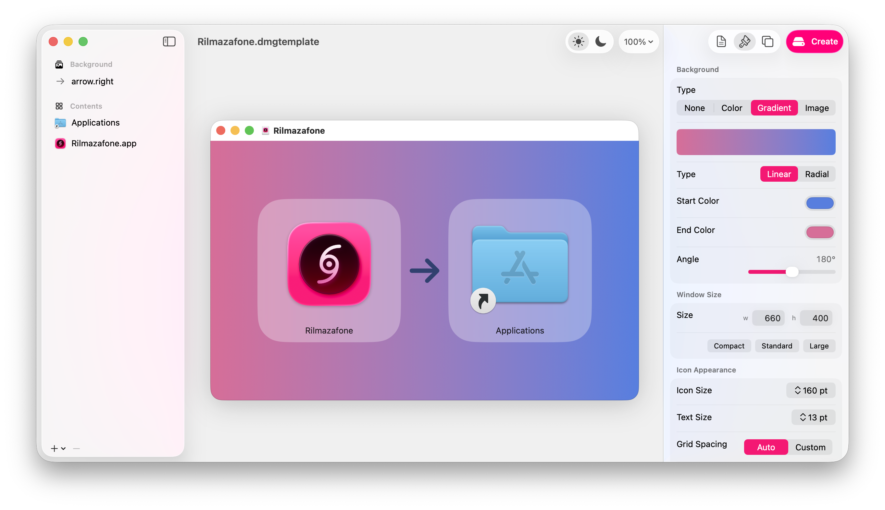

# Rilmazafone

A native macOS app for creating beautifully styled DMG disk images. Design your installer visually with a WYSIWYG canvas, then build a production-ready DMG with one click.



## Features

- **WYSIWYG Canvas** — Drag and position icons exactly as they'll appear in Finder
- **Background Layers** — Images, gradients, or solid colors with blur, color adjustments, vignette, and bloom effects
- **Variable Blur** — Linear or radial blur masks with live preview
- **Text & Symbol Layers** — Add styled text and SF Symbols composited into the background
- **Item Backgrounds** — Per-icon frosted glass panels with shadow, bevel, and blend modes
- **Volume Icon Composition** — Automatically generates a disk icon from your app's icon
- **Alignment Guides** — Smart snapping to center, thirds, and sibling elements
- **Code Signing** — Optional signing with automatic keychain identity detection
- **Multiple Formats** — UDZO, UDBZ, LZFSE, LZMA compression; HFS+ or APFS filesystem
- **Comprehensive Undo/Redo** — Every action is undoable

## Requirements

- macOS 15.0+
- Xcode 16.0+

## Building

```bash
git clone https://github.com/kageroumado/Rilmazafone.git
cd Rilmazafone
open Rilmazafone.xcodeproj
```

Build and run from Xcode (Cmd+R). No external dependencies — the project uses only Apple system frameworks.

### Running Tests

Open the Test navigator in Xcode (Cmd+6) and run all tests, or from the command line:

```bash
xcodebuild test -project Rilmazafone.xcodeproj -scheme Rilmazafone -destination 'platform=macOS'
```

The test suite covers DS_Store binary format correctness, Alias record generation, Codable round-trips, and document read/write with undo.

## Usage

Rilmazafone is a document-based app — each `.dmgtemplate` file represents one DMG design.

### Basic Workflow

1. **Create a new document** (Cmd+N)
2. **Add your app** — Drag a `.app` bundle from Finder onto the canvas, or click the **+** button at the bottom of the sidebar and choose "Add Application...". An Applications symlink and an arrow symbol are added automatically.
3. **Add additional items** — Use the **+** button or drag files/folders onto the canvas to include READMEs, license files, or additional resources. Items can be set to copy or symlink via the inspector.
4. **Design the background** — Switch the background type in the inspector between None, Color, Gradient, or Image. For image backgrounds, drag images onto the canvas or sidebar. Multiple image layers can be stacked and individually adjusted with blur, variable blur, color adjustments, vignette, and bloom effects. Text and SF Symbol layers can also be added — all layers are composited into a single background PNG at build time.
5. **Configure appearance** — Use the inspector to adjust icon size, text size, grid spacing, and window dimensions. Size presets (Compact, Standard, Large) apply coordinated defaults. Per-icon frosted glass backgrounds with shadow and bevel effects can be enabled in the Effects section when an item is selected.
6. **Configure build settings** — In the inspector, choose your compression format and filesystem:

   | Format | Description |
   |--------|-------------|
   | **LZFSE (ULFO)** | Fast, good compression. Default. macOS 10.11+ |
   | **zlib (UDZO)** | Most compatible. Works on all macOS versions |
   | **bzip2 (UDBZ)** | Smaller than zlib, slower to create |
   | **lzma (ULMO)** | Smallest files, slowest compression |

   | Filesystem | Description |
   |------------|-------------|
   | **APFS** | Modern filesystem. Default. macOS 10.13+ |
   | **HFS+** | Legacy. Use for compatibility with older macOS |

   Enable **Code Signing** if you need the DMG signed — Rilmazafone auto-detects signing identities from your keychain. If your app is already signed, the matching identity is pre-selected automatically.

7. **Build** — Click the Build button in the toolbar (or Cmd+Shift+B), choose an output location, and the DMG is created. The build sheet shows progress through each step.

### Command Line

Rilmazafone can also build DMGs headlessly from the terminal, useful for CI/CD pipelines and automation.

```bash
# Generate a starter template
Rilmazafone.app/Contents/MacOS/Rilmazafone init MyApp.dmgtemplate

# Edit document.json to set volume name, items, source paths, etc.
# Then build:
Rilmazafone.app/Contents/MacOS/Rilmazafone build MyApp.dmgtemplate -o dist/MyApp.dmg
```

For convenience, symlink the binary:

```bash
ln -s /Applications/Rilmazafone.app/Contents/MacOS/Rilmazafone /usr/local/bin/rilmazafone
rilmazafone init MyApp.dmgtemplate
rilmazafone build MyApp.dmgtemplate -o MyApp.dmg
```

Run `rilmazafone --help`, `rilmazafone build --help`, or `rilmazafone init --help` for full usage.

**Key `document.json` fields for CLI use:**

| Field | Description |
|-------|-------------|
| `volumeName` | Name shown when the DMG is mounted |
| `items` | Array of icons to place. Set `kind` (`app`, `file`, `folder`, `applicationsSymlink`), `label`, `sourcePath` (absolute or `~/`-prefixed), and `position` (`[x, y]`) |
| `window.width` / `window.height` | Finder window dimensions |
| `iconSize` | Icon size in the Finder window |
| `dmgFormat` | Compression: `ULFO` (LZFSE), `UDZO` (zlib), `UDBZ` (bzip2), `ULMO` (lzma) |
| `filesystem` | `APFS` or `HFS+` |
| `codeSign.enabled` / `codeSign.identity` | Optional code signing |
| `background.type` | `none`, `color`, `gradient`, or `image` |

Progress prints to stderr. Exit code 0 on success, 1 on failure.

## Architecture

Rilmazafone is a SwiftUI document-based app using `ReferenceFileDocument` with a directory-based package format (`.dmgtemplate`).

### Project Structure

```
Rilmazafone/
  Model/          DMGConfiguration — all nested model types (Codable, Sendable, nonisolated)
  Document/       RilmazafoneDocument (ReferenceFileDocument + @Observable) with undo support
  Services/       Stateless service enums for the build pipeline
    BuildManager    @Observable build orchestrator and composite background rendering
    DMGBuilder      hdiutil/codesign process wrapper
    DSStoreWriter   Pure Swift .DS_Store buddy-allocator/B-tree binary format writer
    IconComposer    ICNS parser and volume icon compositor
    AliasRecordBuilder  Classic Alias Manager binary record builder
    CompositeRenderer   CIFilter pipeline for compositing background layers
    ProcessRunner   Async process execution utility
  Views/          SwiftUI views organized by panel (Canvas, Sidebar, Inspector, Sheets, Toolbar)
  Headers/        Bridging header + private QuartzCore headers
```

### Key Design Decisions

- **Zero external dependencies** — Pure Swift with Apple system frameworks only.
- **Stateless services** — `DMGBuilder`, `DSStoreWriter`, `IconComposer`, `AliasRecordBuilder`, and `CompositeRenderer` are enums with static methods. No singletons, no shared mutable state.
- **Pure Swift binary formats** — The `.DS_Store` buddy-allocator/B-tree, ICNS parser, and Alias record builder are implemented entirely in Swift.
- **Comprehensive undo/redo** — Every document mutation registers with `UndoManager` via named action methods.
- **Path portability** — Document files use `~/` abbreviation for source paths, so projects work across machines.
- **Dual `@Observable` + `ObservableObject`** — `RilmazafoneDocument` uses `@Observable` for fine-grained SwiftUI observation and `ObservableObject` for `ReferenceFileDocument` auto-save signaling.

### Build Pipeline

The build process (orchestrated by `BuildManager`) runs in 7 steps:

1. **Estimate size** — Calculate disk image size from source file sizes
2. **Create writable DMG** — `hdiutil create` with the chosen filesystem
3. **Mount** — `hdiutil attach` the temporary image
4. **Copy contents** — Copy/symlink all items into the volume
5. **Configure layout** — Render composite background, write `.DS_Store` (icon positions, window bounds, background alias)
6. **Set volume icon** — Compose app icon onto disk icon (ICNS), apply to volume
7. **Compress** — Detach, convert to final format, optionally code sign

### Private API Usage

`BackdropBlurView.swift` uses `CABackdropLayer` and `CAFilter` (private CoreAnimation APIs) to render real-time backdrop blur effects for item background panels on the canvas. This means:

- The app **cannot be distributed on the Mac App Store** without removing this feature
- These APIs may break in future macOS versions
- The rest of the app uses only public APIs

### Document Format

`.dmgtemplate` files are directory-based packages containing:

```
MyApp.dmgtemplate/
  document.json                # Configuration manifest (all settings as JSON)
  Assets/
    background-<uuid>.png      # Background layer images
    volume-icon.icns           # Custom volume icon (if provided)
    app-icon-<uuid>.icns       # Cached app icons
```

## License

[MIT](LICENSE)
